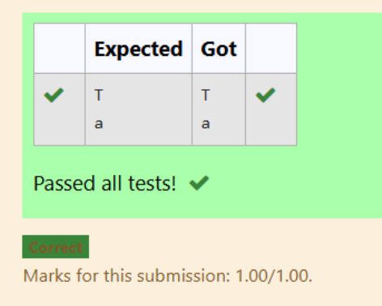

# Datatypes-Character Literal in Python

## 🎯 Aim
To write a Python program that prints the characters `'T'` and `'a'` using character literals.

## 🧠 Algorithm
1. Print the character `'T'`.
2. Print the character `'a'`.

## 🧾 Program
```
a='T'
b='a'
print(a)
print(b)
```
## Output



## Result
Thus,the Python program that prints the characters 'T' and 'a' using character literals is created successfully.